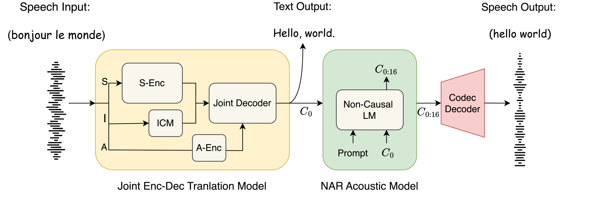

<br>
<p align="center">
<h1 align="center"><strong>TransVIP: Speech to Speech Translation System with Voice and Isochrony Preservation
</strong></h1>
  </p>

<p align="center">
  <a href="https://arxiv.org/abs/2405.17809" target='_**blank**'>
    
  </a>
  <a href="https://arxiv.org/pdf/2405.17809" target='_blank'>
    
  </a>
  <a href="https://www.microsoft.com/en-us/research/project/transvip/" target='_blank'>
    
  </a>
</p>

## Introduction

We introduce <b>TransVIP</b>: a novel model framework TransVIP that leverages diverse datasets in a cascade fashion yet facilitates end-to-end inference through joint probability. Furthermore, we propose two separated encoders to preserve the speaker’s voice characteristics and isochrony from the source speech during the translation process, making it highly suitable for scenarios such as video dubbing.



## Specification of dependencies

A python environment with the following dependencies is required to run the code. The code is tested on Ubuntu 22.04 LTS with Python 3.9.

```bash
conda create -n transvip python=3.9
conda activate transvip
pip install -e fairseq2_011
pip install git+https://github.com/descriptinc/audiotools
pip install -r requirements.txt
```

You may also need a SASC checkpoint for data preparation and model training. Refer to [link](https://github.com/nethermanpro/sascodec) for installation and checkpoint. A pretrained SeamlessM4T model and the corresponding tokenizer is required. It is available at [here](https://github.com/facebookresearch/seamless_communication).

## Prepare Data

### Prepare data for AR model

To prepare data for AR model, the prepared dataset table should contain the following entries: `path`, `sentence`, `codecs`, `vad` and `offset`. For dataset containing paired speech to speech translation data, it will be `path`, `sentence`, `translation`, `src_codecs`,`tgt_codecs`, `src_vad` `tgt_vad`, `src_offset` and `tgt_offset`. A codec model is needed to extract the codec. We take CVSS dataset as an example to show how to prepare training and validation dataset for training the AR model and we will use our SASC codec.

First download [Common Voice 4](https://commonvoice.mozilla.org/en/datasets), [CoVoST 2](https://github.com/facebookresearch/covost) and [CVSS](https://github.com/google-research-datasets/cvss) dataset. Then specify the path to SASC checkpoint and dataset root in the environment variable. Run the following command to prepare the dataset. This will generate a `CVSS_[split].tsv` under OUT_DIR.

```
CODEC_CKPT_PATH=/path/to/SASC/ckpt  \
CV4_ROOT=/path/to/common_voice4/audiodir  \
CoVoST_ROOT=/path/to/covost/root  \
CVSS_ROOT=/path/to/cvss/root  \
OUT_DIR=/path/to/outputdir python tools/build_dataset/cvss.py --split train --lang fr
```

This will generate a tsv file in the dataset folder. You may also prepare MT, ST, ASR dataset for training the AR model. See `models/m4t_valle/dataset.py`

We also provide a script the expand the training set with seamless align dataset. As this is a crawl dataset, use it at your own risk. First download the table for meta data from the [link](https://github.com/facebookresearch/seamless_communication/blob/main/docs/m4t/seamless_align_README.md) and specify the path to the table and the output directory. Run the following command to prepare the training set.

```bash
TABLE_PATH=/path/to/meta/data/table  \
OUT_DIR=/path/to/store/download/audio \
python tools/build_dataset/download_seamless.py
```

Then run the following script to build the dataset

```
CODEC_CKPT_PATH=/path/to/SASC/ckpt  \
AUDIO_DIR=/path/to/seamless/audiodir  \
SRC_LANG=[source language code] \
TGT_LANG=[target language code] \
OUT_DIR=/path/to/outputdir python tools/build_dataset/cvss.py
```

### Prepare data for NAR model

To prepare data for NAR model, as the the training only requires self-supervised unlabeled data, simply prepare a txt file containing the paths to the audio files for training or evaluation.

## Run training

The training configuration is specified in the yaml file under `config/exp_spec`. Before training the model, you need to specify the path to the dataset and the codec model, and optionally the path to the pretrained model.

For training the AR model, it supports training with multiple datasets including ASR, MT and S2ST. The defualt model is based on the SeamlessM4T medium model. So you may load a pretrained model from the SeamlessM4T model.

```bash
python run.py -c s2st.yaml 
```

For training the NAR model, similarily you need to specify the path to the dataset and the codec model.

```bash
python run.py -c nar.yaml
```

If you want to train or finetune the SAScodec model, you can specify the path in `config/exp_spec/sascodec.yaml`. Optionally you can provide the path a semantic encoder to perform semantic distillation. By default it is a MMS-300M model.

```bash
python run.py -c sascodec.yaml
```

## Test samples

Use the following code to test translation samples. Provide the path to the AR model, NAR model, codec model and the tokenizer.

```bash
python inference.py \
    --ar_path ar.pt \
    --nar_path nar.pt \
    --codec_path sascodec.pt \
    --tokenizer_path ./tokenizer \
    --target_lang en \
    -i ./data/input.wav \
    -o ./data/output.wav
```

## Acknowledgement

The majority of the model is build upon the fairseq2 library(<https://github.com/facebookresearch/fairseq2>) 0.1.1 version. We contain a copy of the legacy fairseq2 library in the fairseq2_011 folder. We would like to thank the authors for their valuable contributions and for making their work available as open-source, which has been essential to this project.

## Citation

To cite this repository

```bibtex
@article{le2024transvip,
  title={TransVIP: Speech to Speech Translation System with Voice and Isochrony Preservation},
  author={Le, Chenyang and Qian, Yao and Wang, Dongmei and Zhou, Long and Liu, Shujie and Wang, Xiaofei and Yousefi, Midia and Qian, Yanmin and Li, Jinyu and Zhao, Sheng and others},
  journal={Proceedings of the 38th International Conference on Neural Information Processing Systems (NeurIPS 2024)},
  year={2024}
}
```
